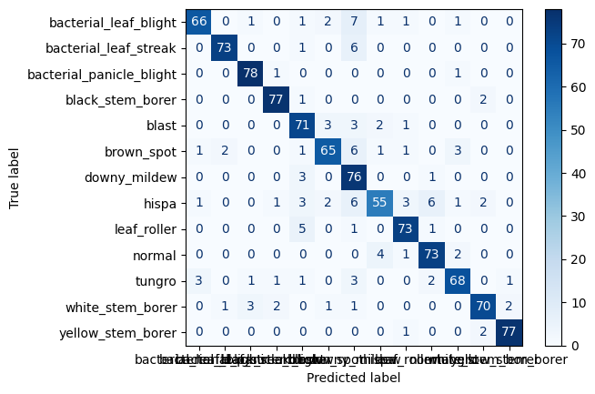

## Deployment

Guides and instructions can be found `deployments` directory.

## Model

- I have run the `TransferModelCNNTrain.py`
- The model is being saved to the `deployments/transfer-model-cnn/transfer_cnn_model.pth`
- `transfer_cnn_model.pth` is loaded at `main.py` for doing predictions

### Performance of the transfer-model (resnet18)

#### Classification Report

```
                          precision    recall  f1-score   support

   bacterial_leaf_blight       0.93      0.82      0.87        80
   bacterial_leaf_streak       0.96      0.91      0.94        80
bacterial_panicle_blight       0.94      0.97      0.96        80
        black_stem_borer       0.94      0.96      0.95        80
                   blast       0.82      0.89      0.85        80
              brown_spot       0.89      0.81      0.85        80
            downy_mildew       0.70      0.95      0.80        80
                   hispa       0.87      0.69      0.77        80
             leaf_roller       0.90      0.91      0.91        80
                  normal       0.88      0.91      0.90        80
                  tungro       0.89      0.85      0.87        80
        white_stem_borer       0.92      0.88      0.90        80
       yellow_stem_borer       0.96      0.96      0.96        80

                accuracy                           0.89      1040
               macro avg       0.89      0.89      0.89      1040
            weighted avg       0.89      0.89      0.89      1040
```

#### Confusion Matrix


